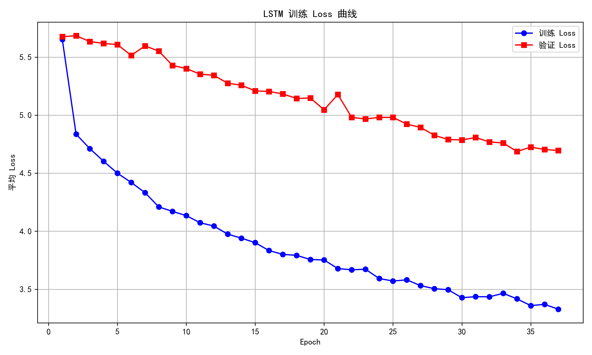
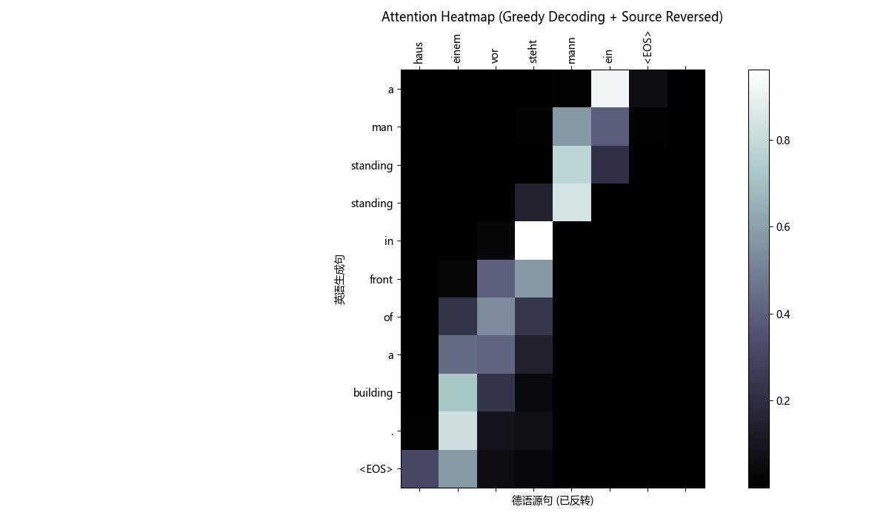

# Seq2Seq Neural Machine Translation from Scratch

从零实现的 Seq2Seq + Bahdanau Attention 神经机器翻译（德语 → 英语，Multi30k 数据集）

## 项目亮点
- 完整复刻 Sutskever 2014 论文核心（调转序列）+加性注意力，几乎复刻了2014-2017年左右主流的机器翻译模型。
- LSTM 模型训练（hidden=256，dropout=0.4，label smoothing）
- 动态 teacher forcing + 梯度裁剪 + AdamW + 学习率调度
- 早停机制 + 验证集监控
- 注意力热图可视化（Matplotlib）
- Beam Search 解码（理论上能提升翻译质量，实际效果很糟糕）
- 批量 BLEU 评估（sacrebleu）

## Loss 曲线（训练 30+ epoch）

**训练 Loss**：蓝色曲线  
**验证 Loss**：红色曲线  
**最佳验证 Loss**：4.3435（早停触发）

## 注意力热图示例（Greedy + Source Reversed）

- 横轴：德语源句（已反转）
- 纵轴：生成的英语句子
- 亮点表示模型在生成该英语词时关注的德语位置

## 实时翻译界面（Gradio）
运行 `translate_gradio.py` 即可启动浏览器界面，支持实时输入德语句子 → 输出英语翻译。（已经部署在huggingface界面）
[huggingface](https://huggingface.co/spaces/xu2409324124/lstm-translator)
## 最终模型
- 最佳 checkpoint：**Epoch35**（BLEU 值为56.3）
- 权重文件：`encoder_lstm_epoch35` / `decoder_lstm_epoch35`（上传到higgingface了，如果您想自己训练一次的话，train文件在windows环境下是完全能跑的）

## 如何运行
1. 安装依赖：`pip install -r requirements.txt`
2. 下载数据集：自动从 Hugging Face 下载 Multi30k
3. 训练：`python train.py`
4. 测试翻译：`python translate.py`
5. 实时界面：`python translate_gradio.py`

欢迎 fork / star！项目记录了完整的 debug 过程，从环境坑到过拟合分析。

感谢 PyTorch 官方教程 + bentrevett/pytorch-seq2seq 仓库的启发。

——————**2026.1.26更新**——————

Bilibili视频已更新：[bilibili](https://www.bilibili.com/video/BV1ezzxBFEA4/?spm_id_from=333.1387.homepage.video_card.click&vd_source=46eef21c98a84797a917421ea20dc08a)
具体的安装步骤和训练流程会逐步以视频形式更新。
