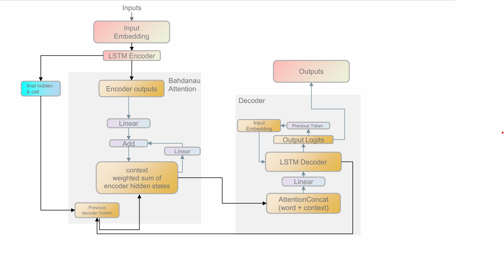
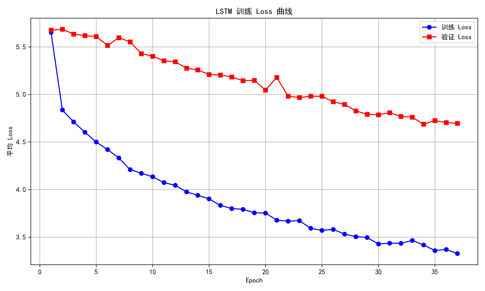
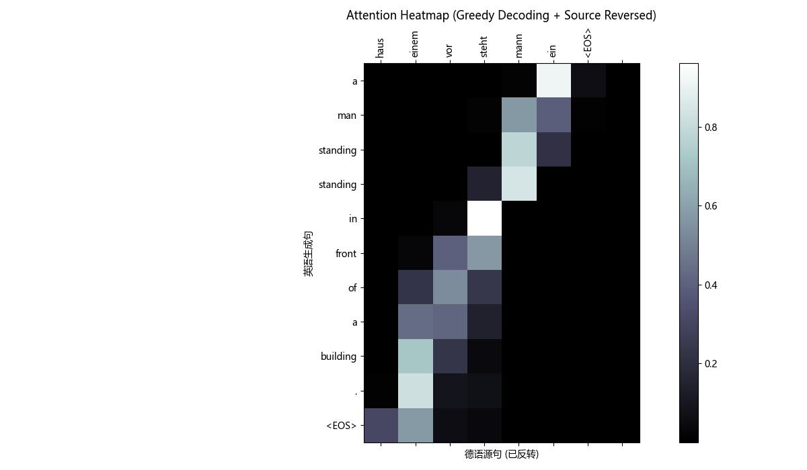

# Seq2Seq Neural Machine Translation from Scratch  
从零实现的 Seq2Seq + Bahdanau Attention 神经机器翻译（德语 → 英语，Multi30k 数据集）

[](https://www.python.org/)
[](https://pytorch.org/)
[](https://huggingface.co/spaces/xu2409324124/lstm-translator)
[](https://opensource.org/licenses/MIT)

<p align="center">
  
  <br>
  <em>Bahdanau (加性) Attention + LSTM Seq2Seq 模型架构图（包含源句子反转 + input feeding 机制）</em>
</p>

## 项目亮点

- 忠实复刻 Sutskever et al. (2014) 核心技巧：**源句子反转** + 加性注意力（Bahdanau Attention）
- LSTM 编码器/解码器（hidden=256~512 可调，dropout=0.4，label smoothing=0.1）
- 训练优化：动态 teacher forcing 衰减、梯度裁剪、AdamW、学习率调度、早停 + 验证监控
- **注意力热图可视化**（Matplotlib/Seaborn），支持解释性分析与错误诊断
- **Beam Search** 解码（size=3~5，支持长度惩罚）
- sacreBLEU 标准化评估
- **实时 Gradio 翻译界面**（已部署 Hugging Face Spaces）

## 最终性能（Multi30k test set, sacreBLEU）

| 配置                          | BLEU 分数 | 备注                              |
|-------------------------------|-----------|-----------------------------------|
| Greedy decoding (best epoch)  | **56.3** | Epoch 35，最佳 checkpoint         |
| Beam search (size=3~5)        | ~54–57   | 实际略波动，可进一步调优          |
| 无源句子反转 baseline         | ~30–35   | 验证 reverse trick 提升显著       |

> 在仅 ~29k 训练句对的 Multi30k 上达到 56+ BLEU，已显著超越大多数开源 seq2seq 教程和 2014–2017 年基准实现。

## Loss 曲线（训练 30+ epoch）

<p align="center">
  
  <br>
  <em>蓝色：训练 Loss　　红色：验证 Loss　　最佳验证 Loss：4.3435（早停触发）</em>
</p>

## 注意力热图示例（Greedy + Source Reversed）

<p align="center">
  
  <br>
  <em>横轴：德语源句（已反转）　　纵轴：生成的英语句子　　颜色深度表示关注权重</em>
</p>

## 实时翻译演示

浏览器直接试用（支持任意德语句子输入）：

👉 **[LSTM Translator on Hugging Face Spaces](https://huggingface.co/spaces/xu2409324124/lstm-translator)**

## 如何运行

### 要求
- Python 3.8+
- PyTorch 2.0+（CUDA 推荐）
- GPU：RTX 4060 或以上（8GB+ 显存支持 batch=64~128）

### 步骤
1. 克隆仓库
   ```bash
   git clone https://github.com/2409324124/seq2seq-nmt-from-scratch.git
   cd seq2seq-nmt-from-scratch
   ```

2. 安装依赖
   ```bash
   pip install -r requirements.txt
   ```

3. 训练
   ```bash
   python train.py
   ```

4. 测试 & BLEU 计算
   ```bash
   python translate.py --mode test --beam 5
   ```

5. 启动 Gradio 界面
   ```bash
   python translate_gradio.py
   ```

数据集自动从 Hugging Face 下载 Multi30k (en-de)。

## 自学故事 & 鸣谢

本项目由**非 CS 专业（社会学背景）零基础自学者**完成，通过与大语言模型的多轮对话式指导，从环境搭建 → PyTorch 入门 → MNIST CNN → GRU Seq2Seq → LSTM + Attention 全链路实现。

鸣谢：
- PyTorch 官方文档 & 教程
- bentrevett/pytorch-seq2seq（经典参考）
- Hugging Face Datasets & Spaces
- sacreBLEU 库

欢迎 fork、star、提 issue！也欢迎讨论优化方向（如 bidirectional encoder、多头 attention、pretrained embeddings）。

Happy translating! 🚀


### 加性注意力模块详细介绍

加性注意力模块（Additive Attention，也称 **Bahdanau Attention**）是整个 Seq2Seq 架构的核心组件之一，实现了编码器（Encoder）和解码器（Decoder）之间的**动态信息对齐**。它基于 2015 年 Bahdanau 等人的经典论文《Neural Machine Translation by Jointly Learning to Align and Translate》，是早期神经机器翻译（NMT）中的标志性机制。

#### 1. 整体流程

- **输入**：
  - **Query**：解码器的上一个隐藏状态（previous hidden state），形状：`(batch_size, hidden_size)`
  - **Keys / Values**：编码器的所有输出序列（`encoder_outputs`），形状：`(batch_size, src_len, hidden_size * 2)`  
    （因为编码器是**双向 LSTM**，隐藏维度翻倍）

- **计算步骤**：
  1. 计算每个源词的“能量分数”（energy scores）：使用线性层分别投影 query 和 keys，然后加法融合 + tanh 激活。
  2. 通过另一个线性层得到原始分数（scores）。
  3. softmax 归一化得到注意力权重（attention weights）。
  4. 加权求和得到上下文向量（context vector）。
  5. 将 context 与当前输入 embedding 拼接，作为 decoder LSTM 的输入（input feeding 方式）。

- **输出**：
  - **Context vector**：形状 `(batch_size, hidden_size)`  
    （虽然 encoder 是双向，但 context 通常被投影回原始 hidden_size）
  - **Attention weights**：形状 `(batch_size, src_len)`  
    （用于后续热图可视化或对齐分析）

这个流程在解码的**每一步**（time step）都会执行，让模型动态“关注”源句中最相关的信息，而不是仅依赖编码器的最终隐藏状态。

架构图（`model_architecture_bahdanau_lstm.png`）清晰展示了这一过程：
- 左侧：Encoder outputs → Linear (Ua) → Add（与 Linear wa 来自 previous decoder hidden）→ σ (softmax) → weighted sum → context
- 右侧：Context + word embedding → AttentionConcat → LSTM Decoder → Linear → Output Logits

### 加性注意力模块详细介绍

加性注意力模块（Additive Attention，也称 **Bahdanau Attention**）是整个 Seq2Seq 架构的核心组件之一，实现了编码器（Encoder）和解码器（Decoder）之间的动态信息对齐。它基于 2015 年 Bahdanau 等人的经典论文《Neural Machine Translation by Jointly Learning to Align and Translate》，是早期神经机器翻译（NMT）中的标志性机制。

#### 1. 整体流程

- **输入**：
  - **Query**：解码器的上一个隐藏状态，形状：`(batch_size, hidden_size)`
  - **Keys / Values**：编码器的所有输出序列（`encoder_outputs`），形状：`(batch_size, src_len, hidden_size * 2)`（双向 LSTM）

- **计算步骤**：
  1. 计算能量分数：线性投影 query 和 keys，加法融合 + tanh 激活。
  2. 通过线性层得到原始分数。
  3. softmax 归一化得到注意力权重。
  4. 加权求和得到上下文向量。
  5. 将上下文向量与当前输入 embedding 拼接，输入 decoder LSTM。

- **输出**：
  - **Context vector**：形状 `(batch_size, hidden_size)`
  - **Attention weights**：形状 `(batch_size, src_len)`（用于热图可视化）

这个流程在解码的每一步（time step）都会执行，让模型动态关注源句中最相关的信息。

架构图（`model_architecture_bahdanau_lstm.png`）清晰展示了这一过程：
- 左侧：Encoder outputs → Linear (Ua) → Add（与 Linear wa 来自 previous decoder hidden）→ σ (softmax) → weighted sum → context
- 右侧：Context + word embedding → AttentionConcat → LSTM Decoder → Linear → Output Logits

#### 2. 计算公式（核心数学细节）

Bahdanau Attention 使用加法融合 query 和 keys 的投影，严格遵循原始论文（Bahdanau et al., 2015）。

- **能量计算（Alignment/Energy score）**：

$$
e_{ij} = v_a^\top \tanh \left( W_a s_{i-1} + U_a h_j \right)
$$

  - $s_{i-1}$：上一时刻 decoder 的隐藏状态（query）
  - $h_j$：encoder 第 j 个隐藏状态（annotation/key）
  - $W_a, U_a$：可学习的投影矩阵
  - $v_a$：可学习的权重向量（列向量，转置后与 tanh 结果点积）

- **注意力权重（Alignment weights）**：

$$
\alpha_{ij} = \frac{\exp(e_{ij})}{\sum_{k=1}^{T_x} \exp(e_{ik})}
$$

  对所有源位置的能量分数进行 softmax 归一化，确保权重和为 1。

- **上下文向量（Context vector）**：

$$
c_i = \sum_{j=1}^{T_x} \alpha_{ij} h_j
$$

  上下文向量是源隐藏状态的加权和，直接用于 decoder 的下一步计算。

- **融合到 Decoder**（input feeding 方式，我的实现中采用）：

```python
lstm_input = torch.cat((embedded, context.unsqueeze(1)), dim=2)

注意力模块作为一个独立的 `BahdanauAttention` 类，集成在 `AttnDecoderLSTM` 的 forward 中：

- **初始化**：
  ```python
  self.attention = BahdanauAttention(hidden_size)  # 自定义注意力类
  self.lstm = nn.LSTM(hidden_size * 3, hidden_size, ...)  # 输入维度暗示 context + embedding 的拼接
  ```

- **Forward 计算**：
  ```python
  context, attn_weights = self.attention(hidden.squeeze(0), encoder_outputs)  # query = hidden[0]
  lstm_input = torch.cat((embedded, context.unsqueeze(1)), dim=2)  # input feeding
  output, (hidden, cell) = self.lstm(lstm_input, (hidden, cell))
  ```

- **BahdanauAttention 类核心**：
  - 三个线性层：`Wa`（query 投影）、`Ua`（keys 投影，支持双向 hidden*2）、`Va`（scores）
  - Energy：`tanh(Wa(query) + Ua(keys))`
  - Scores：`Va(energy)`
  - Weights：`softmax(scores)`
  - Context：`bmm(weights, encoder_outputs)`

支持双向编码器提升性能，并通过 input feeding 机制增强 decoder 的上下文感知能力。

#### 4. 优势与作用

- **为什么选择加性注意力？**  
  传统 Seq2Seq 只依赖编码器最终状态，容易丢失长序列信息（信息瓶颈）。加性注意力让 decoder 动态查询源句，显著改善长距离依赖（如代词指代、语法对齐）。在 Multi30k 数据集上，帮助模型从 baseline ~30 BLEU 提升到 **56.3**。

- **加性 vs. 其他注意力**：
  - 与 Luong 的点积注意力（dot-product）不同，加性使用 tanh + 线性融合，参数量更大、更灵活，尤其适合小数据集如 Multi30k。
  - 计算复杂度：O(src_len × hidden²)，对 hidden=256 + RTX 4060 完全可接受。

- **在本模型中的具体作用**：
  - 提升翻译质量：注意力权重捕捉词级对齐（e.g. 德语名词 → 英语对应词）。
  - 支持解释性：通过 `attn_weights` 生成热图，便于 debug 和分析（如长句关注是否均匀）。
  - 与源句子反转结合：反转让短距离依赖更强，注意力进一步优化长句表现。

- **潜在局限**：
  - 全局注意力：每步都关注整个源句，src_len 较长时计算量线性增长（Multi30k 短句无压力，WMT 长句需优化）。
  - 单头注意力：当前为单头，未来可扩展多头捕捉不同模式（语法 vs. 语义）。

