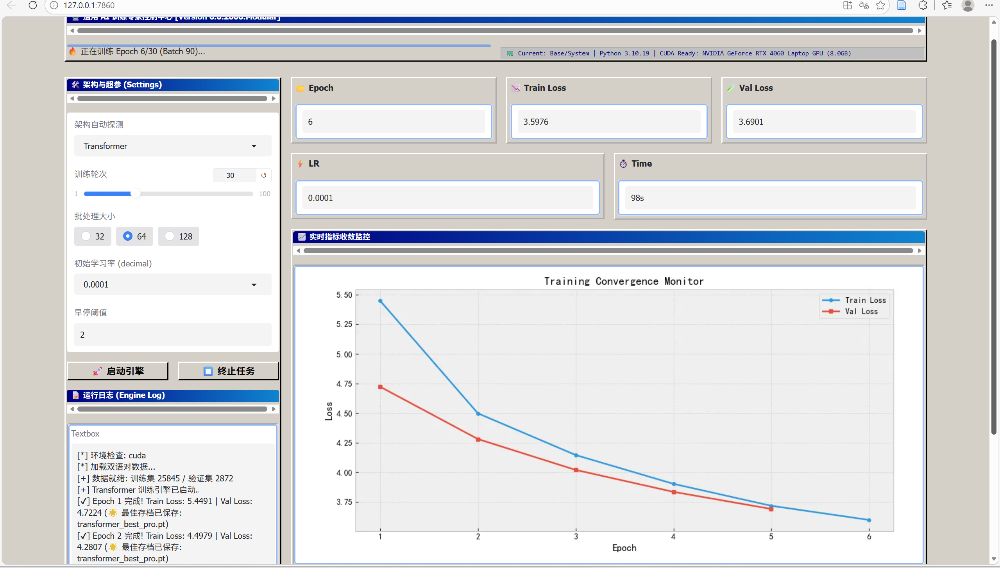

# Language Model Engine Framework

## Intro | 简介

**EN**

This repository has evolved from an early Seq2Seq translation experiment into a unified training framework for classic neural language-model architectures.  
It now focuses on a shared engine abstraction, a realtime Gradio training console, and a modular code layout that makes it easy to switch between multiple model families in one place.

**ZH**

这个仓库已经从早期的 `Seq2Seq` 翻译实验，演进成一个统一的经典神经网络训练引擎框架。  
现在项目的重点不再是“只训练一个翻译模型”，而是通过统一的引擎抽象、实时训练控制台和模块化代码结构，把多种经典模型接到同一个实验工作台里。

## Snapshot | 项目快照

- Realtime training console built with `Gradio`
- Unified `BaseTrainingEngine` abstraction
- Multiple classic architectures under one GUI
- Live metrics, logs, and convergence monitoring
- Auto checkpoint saving based on validation loss

- 基于 `Gradio` 的实时训练控制台
- 统一的 `BaseTrainingEngine` 训练抽象
- 多种经典架构共用同一套 GUI
- 实时指标、日志与收敛曲线监控
- 按验证集 loss 自动保存最佳 checkpoint

## Interface Preview | 界面预览

Below is the current realtime training console screenshot from `train_gui.py`.

下面这张图就是当前 `train_gui.py` 的实时训练控制台界面截图。



## Current Scope | 当前能力

The GUI can currently train these architectures directly:

当前 GUI 已经可以直接切换并训练这些架构：

- `LSTM` with Bahdanau Attention
- `Transformer`
- `BERT` style pretraining engine
- `GPT` style autoregressive language model engine

Current main entry points:

当前主要入口文件：

- `train_gui.py`: realtime training console
- `engines/`: engine implementations for each architecture
- `models_*.py`: model definitions for different architectures

## What This Project Is Now | 现在这个项目是什么

This repository is now better understood as:

这个仓库现在更适合被理解为：

- A training engine framework for classic deep learning architectures
- A reusable experimentation base for model iteration
- A visual training workbench with live feedback

It still reuses the original translation-oriented data pipeline, but the framework layer has already been abstracted into a common engine interface so different models can share:

它仍然沿用了最初项目的翻译数据流基础，但框架层已经抽象成统一引擎接口，不同模型现在可以共享：

- data loading
- training / validation lifecycle
- scheduler integration
- best-checkpoint saving
- realtime visualization through Gradio

- 数据加载流程
- 训练 / 验证生命周期
- 学习率调度
- 最优模型保存逻辑
- 基于 Gradio 的实时可视化界面

## Core Features | 核心特性

- Unified training abstraction via `BaseTrainingEngine`
- Automatic engine discovery through `engines/*_engine.py`
- Realtime loss / LR / time / log updates
- Dynamic train-loss and val-loss plotting
- Safe manual stop during training
- Python environment and CUDA status display in the UI

- 基于 `BaseTrainingEngine` 的统一训练抽象
- 通过 `engines/*_engine.py` 自动发现可用引擎
- 实时刷新 loss、学习率、耗时和日志
- 动态绘制训练集 / 验证集收敛曲线
- 支持训练过程中安全中止
- 在界面顶部显示 Python 环境和 CUDA 状态

## Engine Overview | 引擎概览

### LSTM Engine

- Bidirectional encoder + attention decoder
- Dynamic teacher forcing
- Gradient clipping
- Keeps the classic Seq2Seq training style

- 双向编码器 + 注意力解码器
- 动态 teacher forcing
- 梯度裁剪
- 保留经典 Seq2Seq 训练范式

Files:

- `engines/lstm_engine.py`
- `models_lstm.py`

### Transformer Engine

- Standard encoder-decoder Transformer
- Padding mask and autoregressive mask support
- AMP mixed precision training
- Label smoothing

- 标准 encoder-decoder Transformer
- 支持 padding mask 和自回归 mask
- 使用 AMP 混合精度训练
- 使用 label smoothing

Files:

- `engines/transformer_engine.py`
- `models_transformer.py`

### BERT Engine

- Pretraining-style engine
- Supports MLM and NSP objectives
- Builds training inputs from target-side sequences
- Uses special tokens like `<SOS> <EOS> <PAD> <MASK>`

- 面向预训练风格任务的训练引擎
- 包含 MLM 和 NSP 两类目标
- 基于目标侧序列构造输入
- 使用 `<SOS> <EOS> <PAD> <MASK>` 等特殊 token

Files:

- `engines/bert_engine.py`
- `models_bert.py`

### GPT Engine

- Decoder-only autoregressive language model
- Causal mask support
- Next-token prediction on target-side sequences
- Good entry point for classic GPT-style experiments

- Decoder-only 自回归语言模型
- 支持 causal mask
- 基于目标侧序列进行 next-token prediction
- 适合作为经典 GPT 风格实验入口

Files:

- `engines/gpt_engine.py`
- `models_gpt.py`

## Realtime Console | 实时控制台

Run:

```bash
python train_gui.py
```

The console currently supports:

当前控制台支持：

- automatic architecture discovery
- model switching from a dropdown
- configurable batch size / epoch / learning rate / patience
- live metric cards and log streaming
- convergence plotting during training

- 自动探测可用架构
- 在下拉菜单中切换模型
- 配置 batch size / epoch / learning rate / patience
- 实时指标卡片和日志输出
- 训练过程中动态绘图

The current visual style is a retro Windows 2000 inspired Gradio dashboard.

当前界面风格是一个复古 Windows 2000 风格的 Gradio 控制台。

## Data Pipeline | 数据管线

The default data flow is still based on `Multi30k`:

当前默认数据流程仍然基于 `Multi30k`：

- German sentences as source-side input
- English sentences as target-side output
- `LSTM` / `Transformer` train on the translation task
- `BERT` / `GPT` reuse the current pipeline for language-model-oriented experiments on target sequences

- 输入侧是德语句子
- 输出侧是英语句子
- `LSTM` / `Transformer` 按翻译任务训练
- `BERT` / `GPT` 复用当前数据流，在目标语序列上做语言模型相关实验

Relevant file:

- `utils.py`

Note:

当前仓库的数据底座仍然带有最初翻译项目的痕迹，所以现在更准确的说法是：

- framework layer: already generalized
- data layer: still semi-task-specific

- 框架层已经基本通用化
- 数据层还保留一定任务特定性

## Project Structure | 项目结构

```text
seq2seq_lstm/
|-- engines/
|   |-- base_engine.py
|   |-- lstm_engine.py
|   |-- transformer_engine.py
|   |-- bert_engine.py
|   |-- gpt_engine.py
|-- models_lstm.py
|-- models_transformer.py
|-- models_bert.py
|-- models_gpt.py
|-- train_gui.py
|-- utils.py
|-- utils_sys.py
|-- test_api.py
|-- test_transformer_shapes.py
|-- test_lstm_engine.py
|-- requirements.txt
```

## Quick Start | 快速开始

### 1. Install dependencies | 安装依赖

```bash
pip install -r requirements.txt
```

If this is the first run, prepare the tokenizer models too:

如果是首次运行，还需要准备分词模型：

```bash
python -m spacy download en_core_web_sm
python -m spacy download de_core_news_sm
```

### 2. Launch the console | 启动控制台

```bash
python train_gui.py
```

You can then choose directly in the GUI:

然后你可以直接在 GUI 中选择：

- `Transformer`
- `Lstm`
- `Bert`
- `Gpt`

## Tests | 测试脚本

Current lightweight test / validation scripts:

当前仓库中的轻量测试 / 验证脚本：

- `test_transformer_shapes.py`
- `test_lstm_engine.py`
- `test_api.py`

Examples:

```bash
python test_transformer_shapes.py
python test_lstm_engine.py
```

## Why The README Changed | 为什么 README 要改

The old README mainly described:

旧版 README 主要描述的是：

- a single Seq2Seq translation implementation
- attention heatmaps
- one-model training results

- 单一 Seq2Seq 翻译实现
- 注意力热图
- 单模型训练成果展示

But the project has already shifted:

但项目本身已经发生了明显变化：

- from one model to a multi-engine framework
- from a translation demo to a reusable experiment platform
- from result display to a unified training console

- 从“一个模型”变成“多引擎框架”
- 从“翻译 demo”变成“可复用实验平台”
- 从“结果展示”变成“统一训练控制台”

So the README now reflects the project as it actually is.

所以现在的 README 需要和项目真实状态保持一致。

## Next Directions | 后续可以继续加强的方向

- Add more engines such as `GRU`, `T5`, and `BART`
- Generalize the dataset interface beyond `Multi30k`
- Add resume-from-checkpoint support
- Add inference / evaluation / export modules
- Expand automated tests for each engine
- Replace the preview image with a real `train_gui.py` screenshot

- 接入更多引擎，比如 `GRU`、`T5`、`BART`
- 把数据集接口进一步泛化，不再只绑定 `Multi30k`
- 增加 checkpoint 恢复训练
- 增加推理 / 评测 / 导出模块
- 为不同引擎补齐更系统的测试
- 把当前预览图替换成真正的 `train_gui.py` 界面截图

## Summary | 总结

This is no longer just an old `Seq2Seq NMT` practice repository.  
It is now a PyTorch-based language model engine framework with a realtime Gradio control panel and multiple classic architectures connected through a common training interface.

这个项目已经不再只是早期那个 `Seq2Seq NMT` 练手仓库。  
它现在更像是一个以 PyTorch 为核心、以 Gradio 为实时控制台、以多种经典模型为训练后端的语言模型引擎框架。
